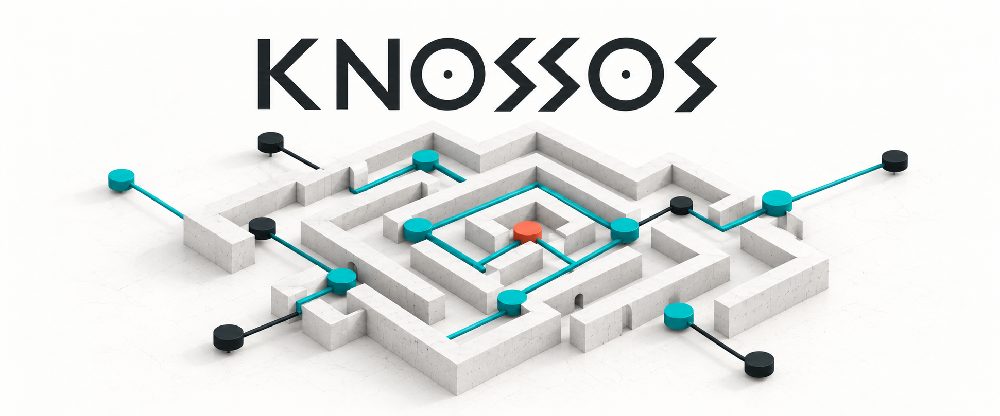
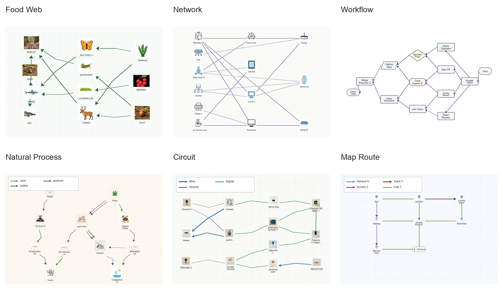

<h1 align="center">Knossos &amp; Ariadne</h1>

<p align="center"><strong>A six-domain benchmark for extracting topology structure from diagrams.</strong></p>

<p align="center">
  <a href="https://bangwayne.github.io/knossos_Ariadne_Public/"></a>
  <a href="https://github.com/bangwayne/knossos_Ariadne_Public"></a>
  <a href="https://huggingface.co/datasets/WayneGuo0011/Knossos"></a>
  <a href="https://arxiv.org/abs/2610.04721"></a>
</p>

<p align="center">
  <a href="https://arxiv.org/abs/2610.04721"><strong>Knossos and Ariadne: Benchmarking and Learning Complete Diagram Topology Extraction with Vision-Language Models</strong></a>
</p>

<p align="center">
  Bangwei Guo &middot; Xujiang Zhao &middot; Shengyu Chen &middot; Yanchi Liu &middot; Wei Cheng<br>
  Xi Zhu &middot; Guoning Zhang &middot; Dimitris N. Metaxas &middot; Haifeng Chen
</p>

<p align="center">
  <a href="#dataset-overview">Dataset Overview</a> &middot;
  <a href="#quickstart">Quickstart</a> &middot;
  <a href="#ariadne">Ariadne</a> &middot;
  <a href="#code-and-assets">Code and Assets</a> &middot;
  <a href="#citation">Citation</a>
</p>

**Knossos** provides **18,000 training diagrams** and **1,200 test diagrams**
with node labels, bounding boxes, typed connections, and connector geometry.
**Ariadne** extracts nodes and source-conditioned edges, with a separate stage
for connector geometry. This repository contains the generation, training,
inference, and evaluation code.

## Dataset Overview



| Domain | Train | Test |
|---|---:|---:|
| Food Web | 3,000 | 200 |
| Network | 3,000 | 200 |
| Workflow | 3,000 | 200 |
| Natural Process | 3,000 | 200 |
| Circuit | 3,000 | 200 |
| Map Route | 3,000 | 200 |
| **Total** | **18,000** | **1,200** |

Images, annotations, task manifests, and renderer assets are available in the
[Hugging Face dataset](https://huggingface.co/datasets/WayneGuo0011/Knossos).
See its [annotation schema and dataset scope](https://huggingface.co/datasets/WayneGuo0011/Knossos#annotations)
for field definitions and split limitations.

## Quickstart

```bash
pip install datasets pillow
```

```python
from datasets import load_dataset

data = load_dataset("WayneGuo0011/Knossos", "default")
example = data["test"][0]
example["image"].save("example.png")
print(example["nodes"], example["edges"])
```

Choose a single domain by replacing `"default"` with `"foodweb"`, `"network"`,
`"workflow"`, `"natural_process"`, `"circuit"`, or `"map_route"`.
Use `streaming=True` to read examples without downloading the full dataset.

<details>
<summary>Download images and manifests for the local code</summary>

From the repository root:

```bash
pip install huggingface_hub datasets pyarrow pillow
hf download WayneGuo0011/Knossos --repo-type dataset --local-dir data/knossos_hub
python data/knossos_hub/export_dataset.py \
  --repository data/knossos_hub \
  --output data/knossos/selected_dataset --manifests
cp -R data/knossos_hub/full_experiments .
```

The exported image paths resolve relative to `data/knossos` when using the
task manifests. To use the frozen renderer assets:

```bash
for archive in data/knossos_hub/renderer_assets/*.tar.gz; do
  tar -xzf "$archive" -C generator
done
```

</details>

## Ariadne

| Stage | Input | Output |
|---|---|---|
| NODE | Diagram | Node inventory |
| EDGE | Diagram, node inventory, source groups | Connections between nodes |
| TRACE | Diagram, nodes, fixed edges | Connector geometry |

Configurations for Qwen3-VL-8B and GLM-4.6V-Flash are in
[`configs/`](configs). Trained inference requires the corresponding backbone
weights and NODE/EDGE adapters; these weights are not included in this repository.

Use Python 3.10 or newer. GPU training and inference require CUDA-compatible
PyTorch; dependency versions are listed in
[`requirements-inference-observed.txt`](requirements-inference-observed.txt)
and [`sft_train/requirements_glm41v_thinking.txt`](sft_train/requirements_glm41v_thinking.txt).

<details>
<summary>Run NODE-then-EDGE inference</summary>

After downloading the data and providing backbone and adapter paths:

```bash
python tools/evaluate_knossos_node_edge_typed_pipeline_vlm.py \
  --node-manifest full_experiments/manifests/knossos_node_inventory_stage1_v1/tgp_knossos_node_inventory/test.jsonl \
  --edge-manifest full_experiments/manifests/knossos_edge_trace5_typed_multigraph_stage2_v1/tgp_knossos_edge_trace5_typed_multigraph/test.jsonl \
  --data-root data/knossos \
  --model-path /path/to/backbone \
  --node-adapter-path /path/to/node-adapter \
  --edge-adapter-path /path/to/edge-adapter \
  --source-group-size 3 --edge-only --load-in-4bit \
  --output-dir outputs/ariadne
```

</details>

## Code and Assets

| Directory | Contents |
|---|---|
| [`generator/`](generator) | Diagram generation, rendering, and visual screening |
| [`sft_train/`](sft_train) | Supervised training |
| [`tools/`](tools) | Inference, graph parsing, scoring, and prediction merging |
| [`configs/`](configs) | Model, adapter, and training configurations |
| [Hugging Face files](https://huggingface.co/datasets/WayneGuo0011/Knossos/tree/main) | Full dataset, task manifests, and renderer assets |

Generator entrypoints and settings are listed in
[`generator/generation_config.json`](generator/generation_config.json).
API-based asset generation and visual screening require your own credentials.

## Citation

```bibtex
@misc{guo2026knossos,
  title={Knossos and Ariadne: Benchmarking and Learning Complete Diagram Topology Extraction with Vision-Language Models},
  author={Bangwei Guo and Xujiang Zhao and Shengyu Chen and Yanchi Liu and Wei Cheng and Xi Zhu and Guoning Zhang and Dimitris N. Metaxas and Haifeng Chen},
  year={2026},
  eprint={2610.04721},
  archivePrefix={arXiv},
  primaryClass={cs.CV},
  url={https://arxiv.org/abs/2610.04721}
}
```

## License

Code is released under the [MIT License](LICENSE-CODE.txt).
The Knossos images, annotations, manifests, and renderer assets use
[CC BY 4.0](LICENSE-DATA.txt). Upstream notices and model terms are in
[`third_party/`](third_party).
